# RepoScope

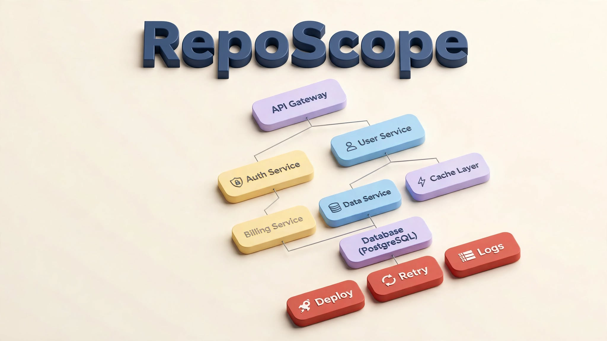

> See your repo. Understand it. Track it.

**🌐 Live:** [repo-scope-nu.vercel.app](https://repo-scope-nu.vercel.app) · **⚙️ API:** [reposope.onrender.com/api/health](https://reposope.onrender.com/api/health) · **🎬 Demo video:** [youtu.be/ZJ7PMCZRXKY](https://youtu.be/ZJ7PMCZRXKY)

    

RepoScope turns any GitHub repository into an interactive architecture graph,
answers questions about it in plain English with citations, and tracks changes
over time. Built with **IBM Bob** (most tasks) and **Z Code** (complex tasks)
for the IBM Bob 2.0 Hackathon.

---

## 📸 Screenshots

All screenshots are captured at **1600×900 (16:9)** and live in [`docs/screenshots/`](docs/screenshots/).

### Full workspace
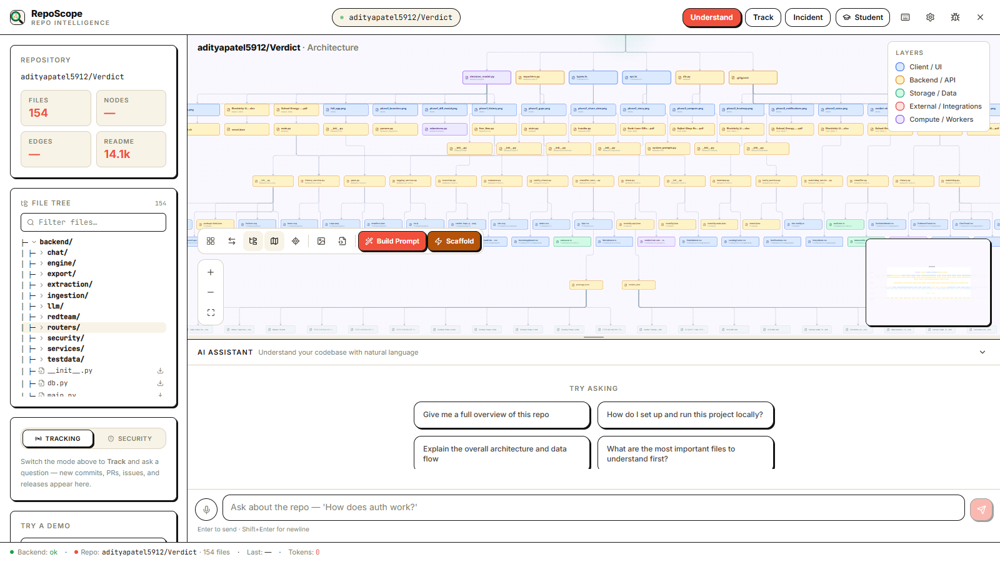
*File tree, layered architecture graph, cited chat answers, and stats in one view — custom RepoScope icon in the top bar.*

### Architecture graph
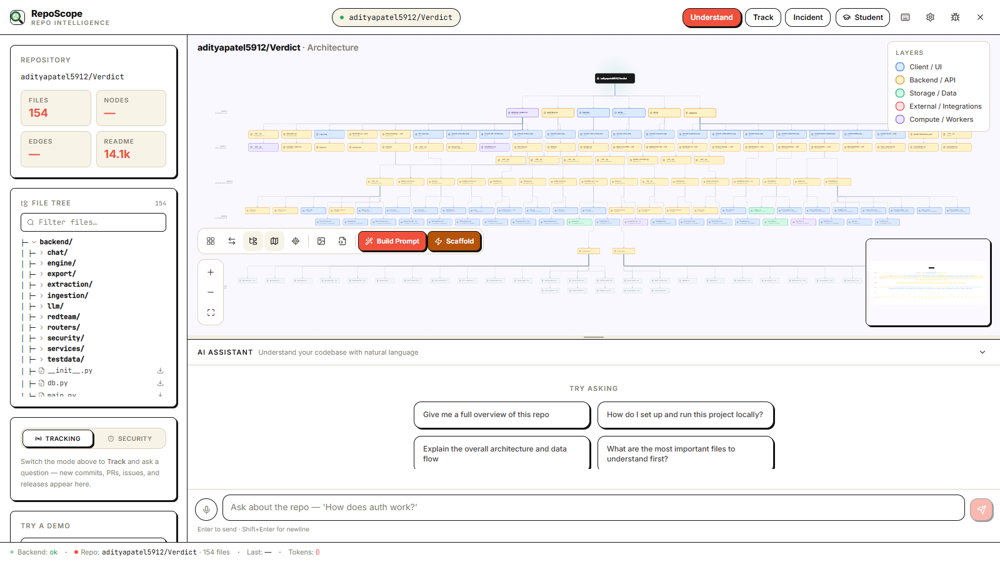
*Connectivity pyramid — the repo at the top, the most-imported files in the rows below. Layer colors: client, backend, storage, external, compute.*

### Chat with citations
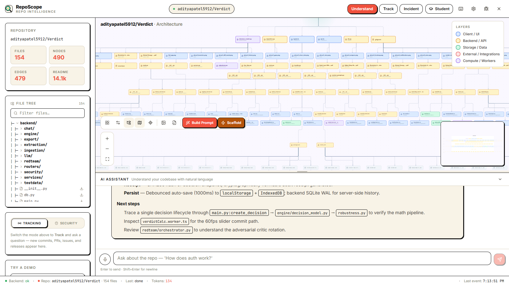
*Ask anything — every answer cites files, functions, and line numbers pulled from the real code graph, with Next-steps guidance.*

### Code tours + voice narration
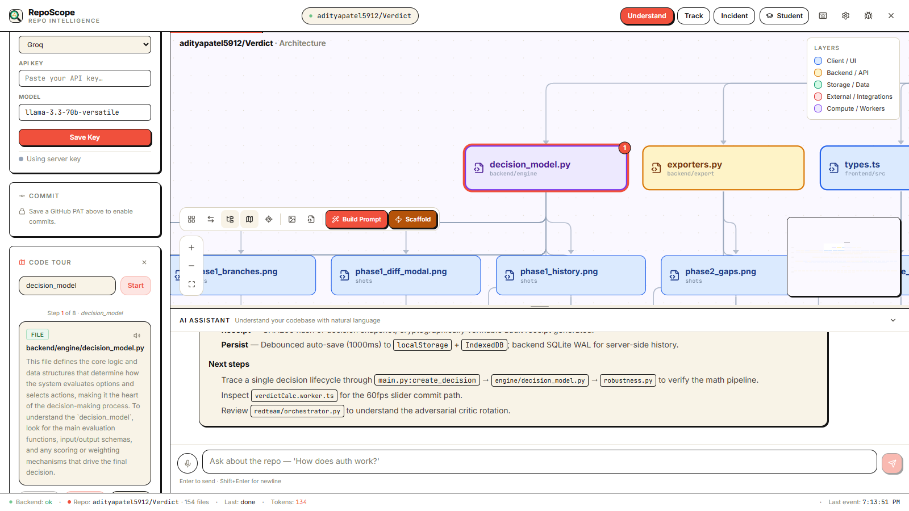
*Guided walkthroughs step through any module — the graph pans to each stop with numbered badges. Press **▶ Play Tour** to hear it narrated (OpenRouter TTS, browser speech fallback).*

### Impact analysis
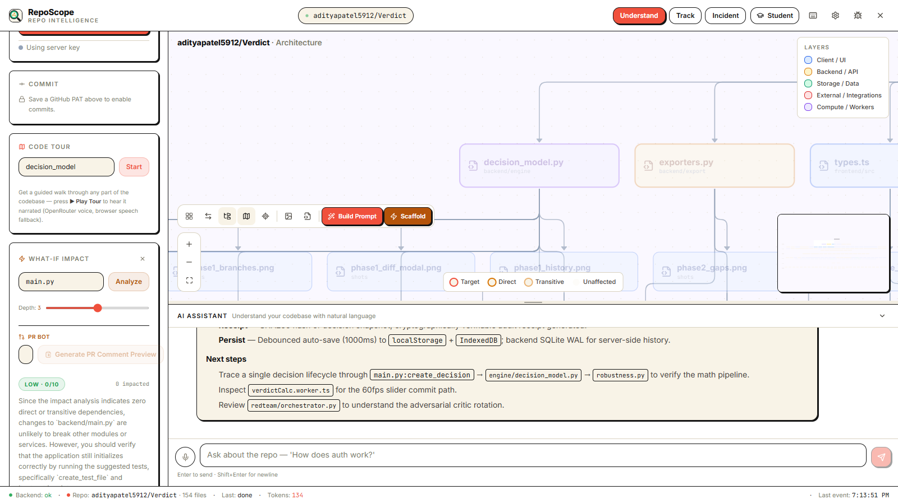
*See the blast radius of a change before you make it — target, direct, transitive, and unaffected states on the graph.*

### PR Bot — impact report on every pull request
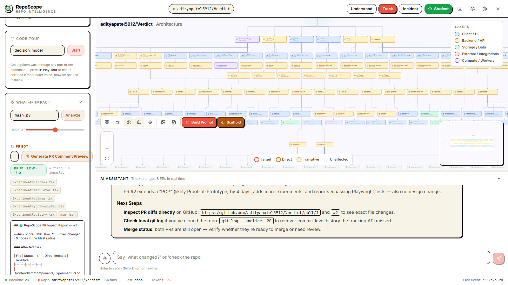
*One click renders a GitHub-ready comment: risk score, affected files, suggested tests, and a mermaid impact graph. The included GitHub Action posts it automatically.*

### Student Mode — pyramid-ranked learning path
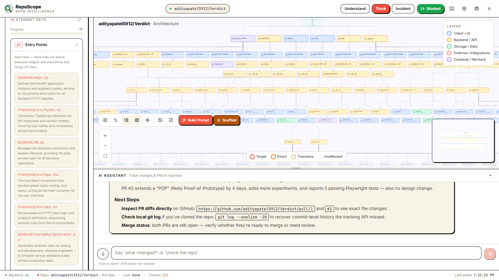
*Toggle **Student** in the top bar: a 3-level curriculum (entry points → core → utils) with per-file "why it matters" notes, checkpoint quizzes, and Good First Issues from the low-traffic rows.*

### Security Scan — secrets, breaking changes, CVEs
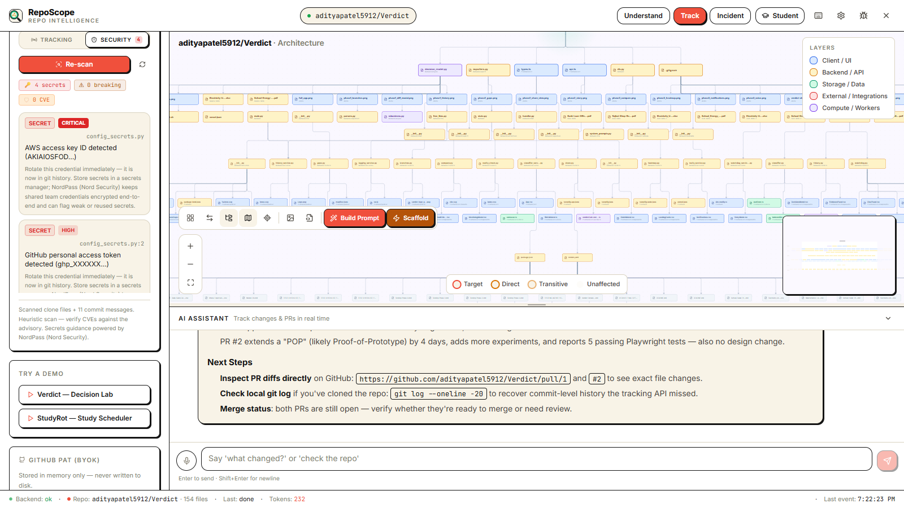
*The Tracking card gains a Security tab: committed API keys (redacted), leaked `.env` files, breaking signature changes, and vulnerable dependency pins — with Nord Security–backed remediation tips.*

### Scaffold — CodeCrafters-style starter
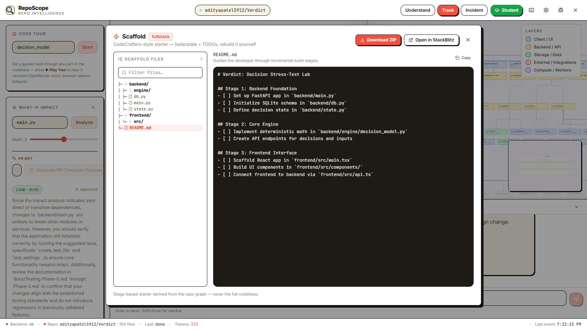
*From the graph toolbar: a Stage 1/2/3 starter scaffold with boilerplate + TODOs. Download as ZIP or open in StackBlitz — never the full codebase.*

### Tracking
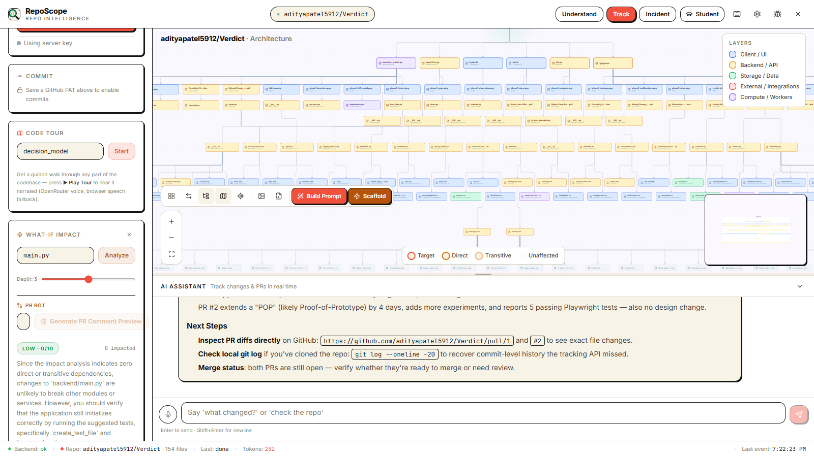
*Commits, PRs, issues, and releases — checked on demand, grouped by change type.*

### One-click demo repos
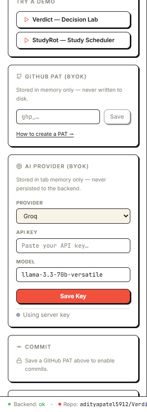
*Click either button in the sidebar to load a real repository instantly.*

---

## 🎬 Demo

### One-click demo repos
Click either button in the sidebar to load a real repository instantly:

- **[Verdict](https://github.com/adityapatel5912/Verdict)** — Decision stress-test lab (Python + React)
- **[StudyRot](https://github.com/adityapatel5912/StudyRot)** — Study rotation scheduler


### Or load your own
Paste any public GitHub URL in the top bar. For private repos, add a GitHub
PAT in the sidebar (BYOK — stored in memory only, never written to disk).

---

## 🎥 Pitch Deck

- 📊 **[pitch-deck.pdf](frontend/public/pitch/pitch-deck.pdf)** — 10 slides
- 🎞️ **[pitch-deck.pptx](frontend/public/pitch/pitch-deck.pptx)** — editable
- 📝 **[pitch-deck.md](frontend/public/pitch/pitch-deck.md)** — text version
- 🎤 **[pitch-script.md](frontend/public/pitch/pitch-script.md)** — 3-minute video script
- 🗒️ **[slide-notes.md](frontend/public/pitch/slide-notes.md)** — per-slide talking points
- 🖼️ **[Thumbnail.png](Thumbnail.png)** — video thumbnail


---

## 🤖 Built with IBM Bob + Z Code

RepoScope's primary build was driven through **IBM Bob 2.0** across 8 guided
sessions. **Z Code (GLM)** paired on the complex tasks: the editorial UI
redesign, the dagre graph layout diagnosis and camera fix, the hardening and
regression passes, and the submission assets.

| Session | Task | Screenshot |
|---|---|---|
| 1 | Full build — all Bob-owned tasks complete | 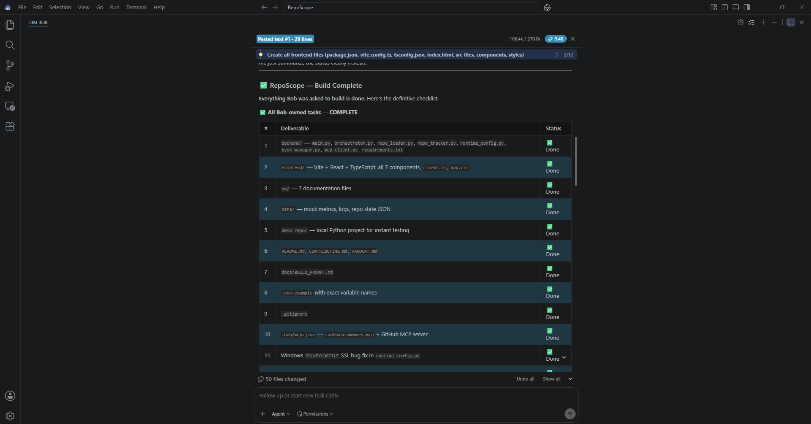 |
| 2 | Frontend + graph renderer (Aurora UI) | 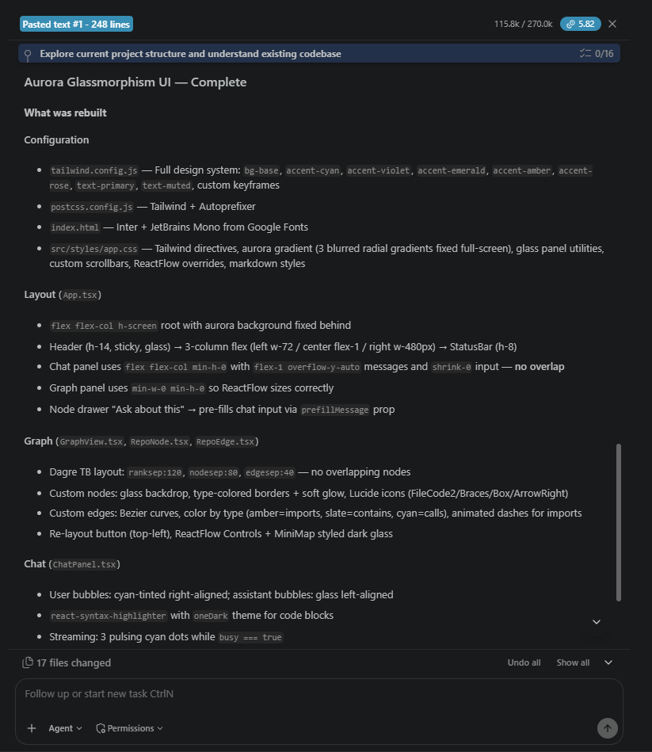 |
| 3 | Critical bug fixes (SSE · graph · README) | 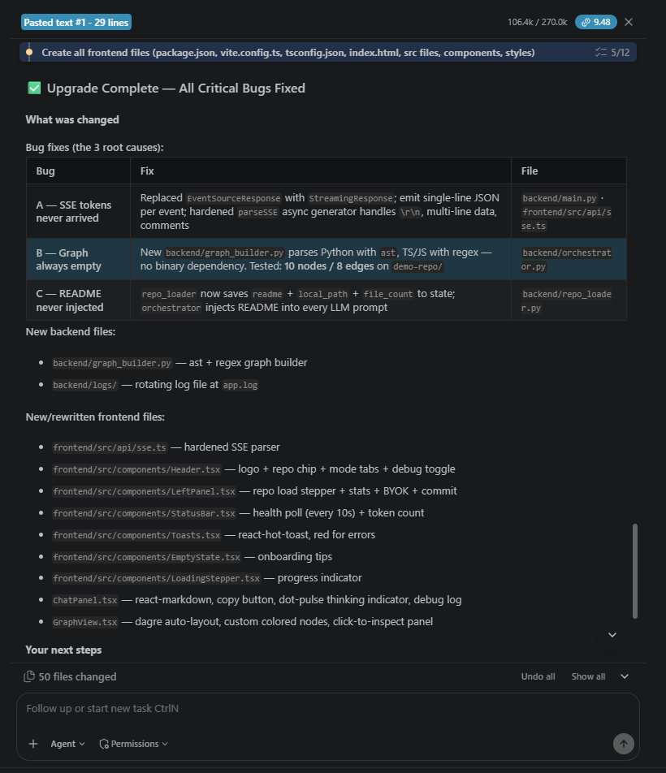 |

Full session log: [docs/bob_sessions/bob-session-export.md](docs/bob_sessions/bob-session-export.md) ·
Details: [docs/BOB_SESSIONS.md](docs/BOB_SESSIONS.md)

---

## ✨ Features

- **Architecture Graph (Visual Overhaul)** — deterministic 6-tier connectivity pyramid
  - Ranks 0..6 size hierarchy (320×80 repo node down to 160×40 docs nodes)
  - Explicit top-to-bottom handle routing (`out` at bottom → `in` at top)
  - Strict parent-to-child edge filtering (`t === s + 1`)
  - Canvas rank labels on the left edge with editorial typography
  - Lineage hover path highlighting in emerald green (`#10B981`)
  - `#FAF8FF` warm canvas with `#D9D2C0` dot grid and repo radial halo
  - Guaranteed 2D collision resolution pass with zero node overlaps
  - Export to PNG and SVG
- **Conversational Q&A & Code Rendering** — SSE-streamed answers with file/function/line
  citations, rich Markdown tables, lists, and high-contrast dark code blocks
  (`#F5F1E8` text on `#1E1B16` charcoal) with bash command auto-detection, copy buttons, and voice input
- **AI Provider BYOK** — Bring Your Own Key support for Groq, NVIDIA NIM, OpenAI, Anthropic,
  and Custom OpenAI-compatible endpoints; saved exclusively in `sessionStorage` (cleared on tab close)
- **Responsive Workspace** — Adaptive across desktop (1440px), tablet (1024px, 768px), and mobile (375px)
  with mobile drawer overlay, top bar toggle, and flexible layout
- **Code Tours** — guided step-by-step walkthroughs of any module, numbered
  badges on the graph, progress bar, auto-pan camera
- **What-If Impact Analysis** — blast radius (direct + transitive) with
  risk score, narrative, suggested tests, and on-graph highlighting
- **Repo Tracking** — new commits, PRs, issues, releases on demand, grouped
  by change type with breaking-change flags
- **Reverse Build Prompt** — one click turns any repo into an agent-ready
  "Build me a…" prompt (copy or save as .md)
- **File Tree** — GitIngest-style tree, search filter, single-file download
- **GitHub PAT BYOK** — GitHub PAT for private repos; memory-only storage
- **Multi-key rotation** — comma-separated keys per LLM provider; 429s rotate
  automatically, providers chain OpenRouter → Groq → NVIDIA NIM
- **PR Bot** — blast-radius report on every pull request: risk score, affected
  files, suggested tests, and a mermaid impact graph that renders live in the
  PR comment; one-click preview in the Impact panel, GitHub Action included
- **Student Onboarding Mode** — pyramid-ranked 3-level learning path (entry
  points → core modules → utils) with per-file "why it matters" notes, 3
  checkpoint quizzes per level, and Good First Issues mined from the
  low-traffic bottom rows
- **Voice Code Tours** — narrated walkthroughs via OpenRouter TTS
  (Fish Audio S2.1 Pro → Deepgram Flux) with browser speech fallback; auto-pan
  and highlight stay synced with the audio — built for accessibility
- **Security Scan** — Breaking Change + Secret + CVE detection with Nord
  Security–backed remediation tips: committed API keys, leaked `.env` files,
  function signature changes, major version bumps, and known-vulnerable pins
- **Reverse Prompt → Scaffold** — turn the reverse-engineered build prompt
  into a CodeCrafters-style starter scaffold: Stage 1/2/3 README stub,
  boilerplate files with TODOs, ZIP download, one-click StackBlitz
- **Health system** — `GET /api/health` reports uptime, memory, key counts

---

## ⚡ NEW in 3.0: Student Mode, PR Bot & Scaffold

Five features landed in the 3.0 sprint — all additive, no breaking changes:

| Feature | What it does | Try it |
|---|---|---|
| 🎓 **Student Mode** | Connectivity-pyramid-ranked learning path with quizzes + Good First Issues | Toggle **Student** in the top bar, load a repo |
| 🤖 **PR Bot** | Posts a blast-radius report (risk, files, tests, mermaid graph) on every PR | Impact panel → *Generate PR Comment Preview*, or add `pr-impact.yml` |
| 🔊 **Voice Tours** | Narrated code tours with auto-pan + highlight sync | Code Tour → **▶ Play Tour** |
| 🛡 **Security Scan** | Breaking changes, leaked secrets, vulnerable deps — Nord Security tips | Tracking card → **Security** tab → *Run Security Scan* |
| ⚡ **Scaffold** | CodeCrafters-style starter (Stage 1/2/3) from any repo — ZIP or StackBlitz | Graph toolbar → **Scaffold** (or the Build Prompt modal) |

New endpoints: `POST /api/scaffold` · `POST /api/impact/pr` ·
`POST /api/onboard` · `POST /api/tts` · `POST /api/security/scan` — all covered
by pytest in [`backend/tests/`](backend/tests/).

---

## 📐 How the Graph Reads

The graph is a deterministic **connectivity pyramid** with 6 rank tiers:

- **Rank 0 (320×80)** — The repository root node with an emerald radial glow (`.repo-halo`)
- **Rank 1 (260×64)** — Backbone files (top entry points by import connectivity)
- **Rank 2 (240×56)** — Core modules and foundational logic
- **Rank 3 (220×52)** — Routers, services, and state management
- **Rank 4 (200×48)** — UI components and view layers
- **Rank 5 (180×44)** — Configuration files, build configs, and environment specs
- **Rank 6 (160×40)** — Documentation, tests, demo datasets, and static assets

### Layout & Connection Rules
- **Explicit Handle Routing**: All edges emerge strictly from the bottom handle (`out`) of the parent and enter the top handle (`in`) of the child.
- **Parent-to-Child Edge Filtering**: Edges only render between adjacent tiers (`targetRank === sourceRank + 1`), eliminating horizontal criss-crossing.
- **Lineage Hover Highlighting**: Hovering over any node dynamically traces its complete ancestor chain up to the repository node in `#10B981` emerald.
- **Zero-Overlap Collision Pass**: Rows wider than 6000px automatically wrap into sub-rows separated by a 40px vertical gap, followed by a 2D bounding-box collision sweep that enforces a minimum 24px horizontal clearance.

### Student Mode & Row Ranking
**Student Mode** turns the same ranking into a curriculum: **Row 1** files
become **Level 1 — Entry Points** (where execution begins), **Rows 2–3** become
**Level 2 — Core Modules** (the engine room), and **Rows 4–5** become
**Level 3 — Utils & Leaves**. Because Rows 4–5 hold the least-imported files,
they're the safest to read — and to change — which is exactly where the Good
First Issue generator mines its beginner-friendly contributions.

---

## 🚀 Quick Start

```bash
# 1. Clone
git clone https://github.com/adityapatel5912/RepoScope.git
cd RepoScope

# 2. Configure environment
cp .env.example .env
# Edit .env — add at least one LLM key (OpenRouter / Groq / NVIDIA)

# 3. Backend
pip install -r backend/requirements.txt
cd backend && uvicorn main:app --reload --port 8000

# 4. Frontend (new terminal)
cd frontend
npm install
npm run dev

# 5. Open http://localhost:5173 and click a demo repo
```

---

## ⚙️ Configuration

| Variable | Required | Purpose |
|---|---|---|
| `OPENROUTER_API_KEYS` | Yes* | Primary LLM — comma-separate for rotation |
| `GROQ_API_KEYS` | Yes* | Secondary LLM — comma-separate for rotation |
| `NVIDIA_API_KEYS` | Fallback | Tertiary LLM — comma-separate for rotation |
| `Models_OPENROUTER` / `Models_GROQ` / `Models_NVIDIA` | No | Model overrides (first entry wins) |
| `Base_URL_OPENROUTER` / `Base_URL_GROQ` / `Base_URL_NVIDIA` | No | OpenAI-compatible endpoints |
| `GITHUB_TOKENS` | Optional | Raises GitHub API limits — comma-separate |
| `CODEBASE_MEMORY_PATH` | No | MCP codebase-memory binary (graph fallback) |

\* At least one provider needs a key. Legacy single-key variables
(`OPENROUTER_API_KEY`, `GROQ_API_KEY`, `NVIDIA_API_KEY`, `GITHUB_PAT`) are
still supported as fallbacks. See [.env.example](.env.example).

---

## 🏗️ Architecture

```
React UI (Vite + TS)
   │  SSE: context → token → tracking → done | error
   ▼
FastAPI (Python 3.11)
   ├─ repo_loader      clone + README + state
   ├─ graph_builder    AST/regex → nodes + edges
   ├─ orchestrator     graph + README → LLM context
   ├─ key_rotator      multi-key round-robin per provider
   ├─ runtime_config   OpenRouter → Groq → NVIDIA NIM chain
   ├─ mcp_client       GitHub REST + codebase-memory MCP
   ├─ tour_generator / impact_analyzer / repo_tracker
   ├─ pr_impact        PR blast radius → GitHub comment
   ├─ onboarding       Student Mode rows + quizzes + GFIs
   ├─ security_scanner secrets / breaking / CVE heuristics
   └─ tts_service      OpenRouter TTS chain for Voice Tours
```

See [docs/ARCHITECTURE.md](docs/ARCHITECTURE.md) for the full reference.

---

## ☁️ Deployment

| | URL |
|---|---|
| **Frontend** | [https://repo-scope-nu.vercel.app](https://repo-scope-nu.vercel.app) |
| **Backend API** | [https://reposope.onrender.com](https://reposope.onrender.com) |
| **Health check** | [https://reposope.onrender.com/api/health](https://reposope.onrender.com/api/health) |

Deployed via [`render.yaml`](render.yaml) (backend) and [`frontend/vercel.json`](frontend/vercel.json) (frontend). All `/api/*` calls are proxied from Vercel to Render.

See [docs/DEPLOYMENT.md](docs/DEPLOYMENT.md).

---

## 📚 Documentation

- [Architecture](docs/ARCHITECTURE.md)
- [Features](docs/FEATURES.md)
- [Demo Script](docs/DEMO.md)
- [Development](docs/DEVELOPMENT.md)
- [Deployment](docs/DEPLOYMENT.md)
- [Troubleshooting](docs/TROUBLESHOOTING.md)
- [Screenshots](docs/SCREENSHOTS.md)
- [Bob Sessions](docs/BOB_SESSIONS.md)
- [Knowledge Graph Schema](docs/KNOWLEDGE_GRAPH_SCHEMA.md)
- [Runbooks](docs/RUNBOOKS.md)
- [Contributing](CONTRIBUTING.md)

---

## 🛠️ Tech Stack

| Layer | Technology |
|---|---|
| Frontend | React 18, Vite 6, TypeScript (strict), React Flow (custom pyramid layout), Tailwind |
| Backend | Python 3.11, FastAPI, SSE (StreamingResponse), httpx, GitPython |
| LLM | OpenRouter (primary) → Groq → NVIDIA NIM, multi-key rotation |
| Code graph | AST (Python) + regex (JS/TS) via graph_builder, MCP fallback |
| Repo data | GitHub REST API v3 |

---

## 📄 License

MIT — see [LICENSE](LICENSE).

---

## 🙏 Acknowledgments

Built with **IBM Bob 2.0** and **Z Code**. Graph aesthetic inspired by
GitDiagram. Reverse prompt inspired by GitReverse. Repo structure format
inspired by Gitingest.
